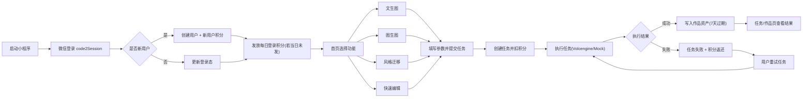

# 幻头AI小程序 - 当前可实现功能与应用流程

最后更新：`2026-03-13`

## 1. 使用前提（按你当前方案）

- 部署方式：本地后端 + 内网穿透（固定 HTTPS 映射地址）。
- 小程序调用：请求地址指向当前内网穿透域名。
- 登录方式：微信 `code2Session` 已接通。
- AI生成：火山引擎文生图/图生图/参考图风格迁移可调用。
- 存储与审核：COS 可上传可访问；COS/CI 文本与图片审核可接入任务拦截。

## 2. 当前版本可实现的用户功能清单

### 2.1 用户账号与积分

- 微信登录（新用户自动创建账号）。
- 登录态为 JWT（`access_token + refresh_token`）。
- 支持刷新登录态与登出（当前会话/全部会话）。
- 新用户赠送积分。
- 每日首次登录赠送积分。
- 查询积分余额与积分规则。
- 查询积分流水。

### 2.2 AI生成任务

- 创建任务（支持 4 类）：
  - `txt2img`：文生图
  - `img2img`：单图修改
  - `style_transfer`：双图参考风格迁移
  - `quick_edit`：快速编辑（已支持基础编辑参数）
- 提交任务时按任务类型扣积分。
- 执行任务（`mock` 或 `volcengine`）。
- 查询任务列表、任务详情。
- 失败任务可重试。
- 失败自动积分返还（防重复返还）。

### 2.3 作品记录

- 任务成功后自动写入作品资产记录。
- 资产记录包含：来源任务、URL、过期时间（7天）。
- 火山引擎返回图会先下载，再上传到本地/COS，避免只依赖外链。

### 2.4 收藏能力

- 收藏作品。
- 取消收藏。
- 查看收藏列表。

### 2.5 管理后台能力（API + 简易 Web）

- 管理总览统计（用户/任务/作品）。
- 用户管理（列表、启用/禁用）。
- 积分调整（管理员加减分）。
- 任务重试（管理员触发）。
- 作品下架（管理员下架违规内容）。
- 简易管理控制台：`/api/v1/admin/console`。

### 2.6 审核治理能力

- 创建任务/执行任务时支持文本与图片审核拦截。
- 支持腾讯审核回调接收与审核审计入库。
- 回调命中违规可自动下架关联作品。

### 2.7 运维与稳定性（当前版）

- 已有结构化请求日志与 `X-Request-Id` 全链路定位。
- 已有基础限流（全局 + `auth` + `tasks/execute`）防刷。
- 已有观测指标接口：`/api/v1/health/metrics`（管理员鉴权）。
- 已支持 Sentry 配置式接入（配置 DSN 即可启用）。

## 3. 当前可跑通的用户服务流程（小程序侧）

1. 用户进入小程序，触发微信登录。
2. 后端创建/更新用户，并发放新用户或每日积分。
3. 用户选择功能（文生图 / 图生图 / 风格迁移 / 快速编辑）。
4. 用户填写提示词、上传图片（按功能需要）。
5. 小程序调用创建任务接口，后端扣积分并返回任务ID。
6. 小程序调用任务执行接口，后端请求火山引擎生成。
7. 生成成功后返回图片URL并写入作品记录；失败则写失败状态并返还积分。
8. 用户在“我的作品/任务列表”查看结果，继续二次操作。

## 4. 小程序应用流程图（当前版本）

## 5. 对你当前阶段的结论

- 如果目标是“内测可用、流程可跑通”，当前能力已经可以进入下一步开发联调。
- 如果目标是“长期稳定运营”，仍建议后续补：异步队列增强（Redis/Celery）、日志聚合告警、备份恢复演练与更细粒度风控。
